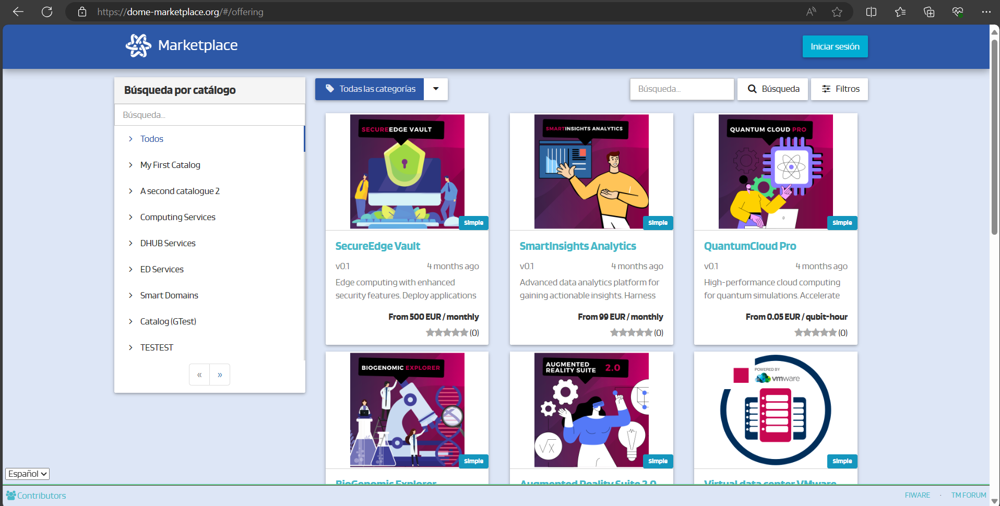
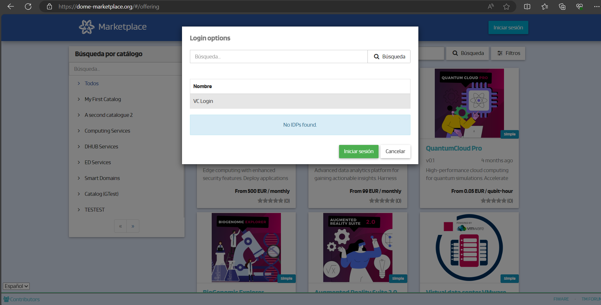
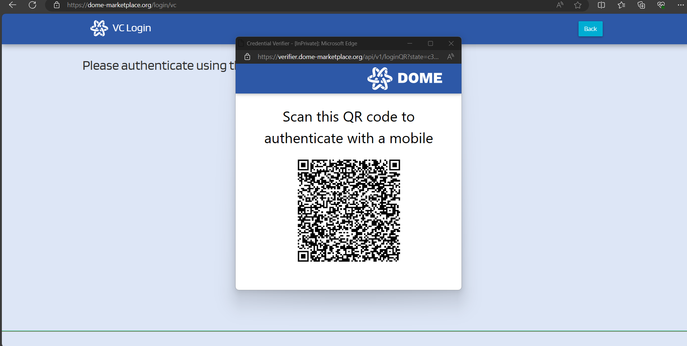
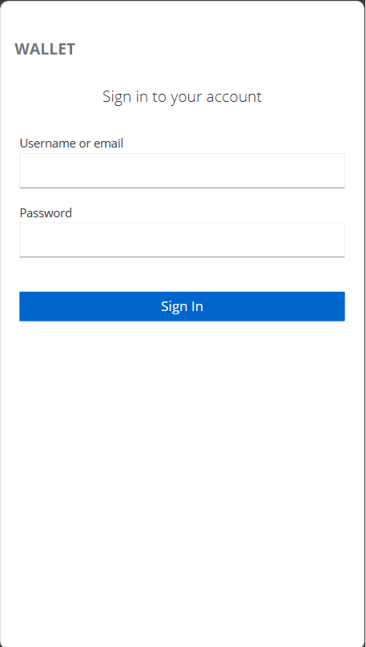
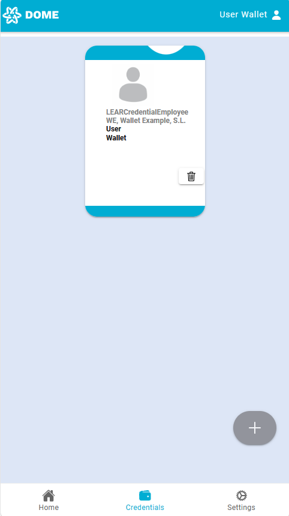
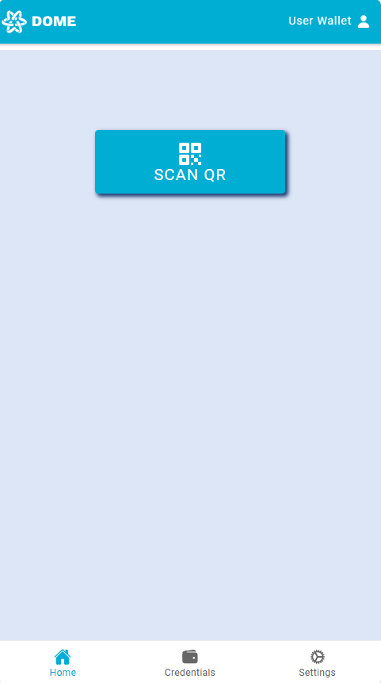
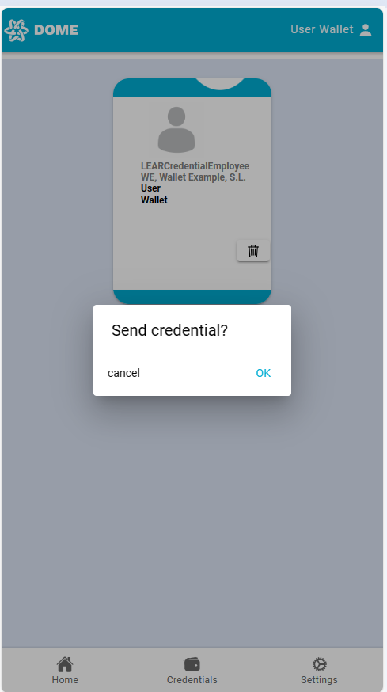
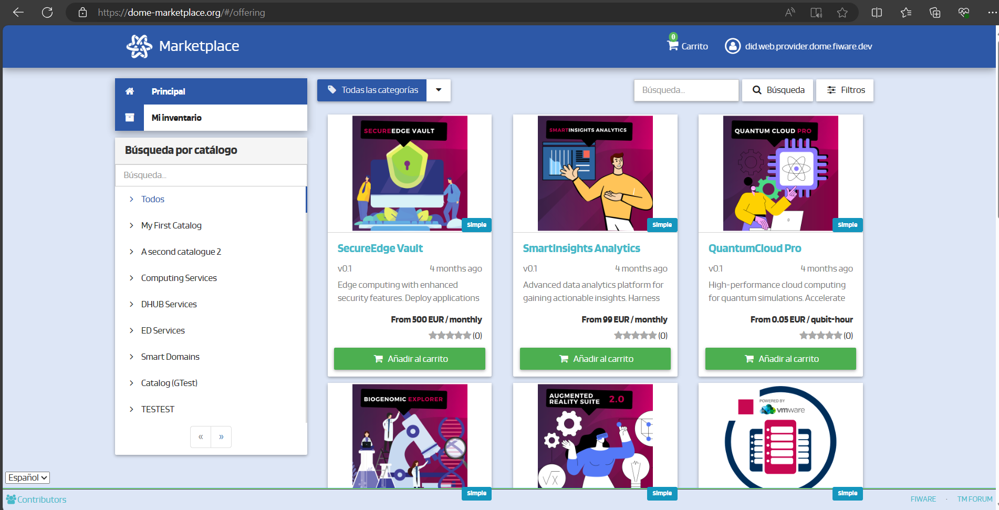
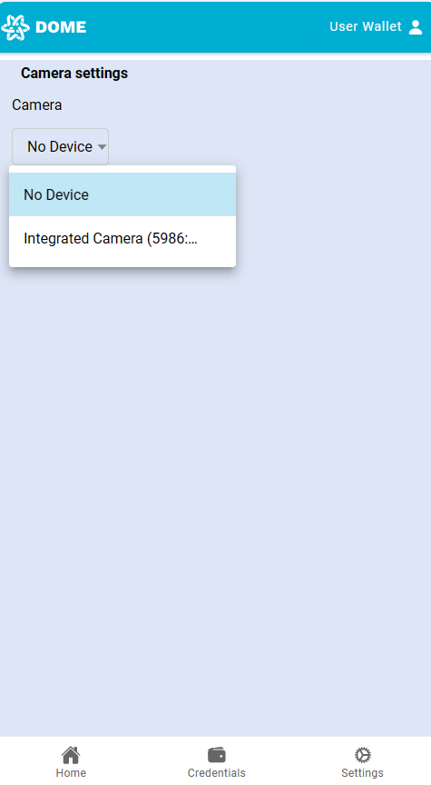

# Onboarding

## How to request your Demo LEAR Credential
To begin the process of obtaining your Demo LEAR Credential, please send an email to [ruben.modamio@in2.es ](mailto:ruben.modamio@in2.es) with the required information listed below. This will help us create your credential efficiently. Note that the Mandator data can be extracted from your organization's EIDAS digital certificate.

### Required Attributes:
+ DID Web name: The ID format should be did:web:<organizationDND> (e.g., did:web:in2.es)

### Mandator Attributes:
+ OrganizationIdentifier: (e.g., VATES-B60645900)
+ CommonName: (e.g., IN2)
+ EmailAddress: (e.g., rrhh@in2.es)
+ SerialNumber: (e.g., B60645900)
+ Organization: (e.g., IN2, Ingeniería de la Información, S.L.)
+ Country: (e.g., ES)

### Mandatee Attributes:
+ First Name: (e.g., Rubén) 
+ Last Name: (e.g., Modamio)
+ Gender: (e.g., M)
+ Email: (e.g., ruben.modamio@in2.es)
+ Mobile Phone: (e.g., +34999999999)

## How to access the portal once you have your credentials

This section will guide you through the steps to access the Dome Marketplace using the VC Login option, utilizing a demo user account for demonstration purposes.

### Step 1: Access DOME Marketplace

Visit the Dome Marketplace by clicking on the following link: [DOME Marketplace](https://dome-marketplace-dev.org).

### Step 2: Sign In

1. Click on the **Sign In** button.
2. Select **VC Login** from the options available.

A QR code will be displayed on the screen. This QR code is unique to your login session and should be scanned using the DOME Wallet app.

> **Note**: Do not attempt to scan the example QR code below, as it is only for demonstration purposes. Each QR code is unique and must be scanned during the current session to ensure security.

### Step 3: Log into DOME Wallet

1. Go to the DOME Wallet website: [DOME Wallet](https://dome-wallet.eu).
2. Log in using the demo user credentials:
    - Username: `userWallet`
    - Password: `userPass`

Upon logging in, navigate to the **Credentials** tab to view the VC that will be used for this demo.

### Step 4: Scan QR Code

Go back to the **Home** screen and press the **Scan QR** button to scan the QR code displayed on the Dome Marketplace login page.

### Step 5: Complete Attestation Exchange

After scanning the QR code, the Wallet and Verifier initiate the AttestationExchange process and in the wallet, you will be asked to select the credential you wish to present to enter the portal. In this example case, as we only have one, we will use that. Once selected, a pop-up will appear to confirm if we want to use that credential.

Upon successful completion, you will be redirected and logged into the marketplace.

The AttestationExchange process has concluded successfully, and you are now logged into the Dome Marketplace. You have full access to explore its functionalities and features available for demo users.

### Troubleshooting: Camera Not Activating for QR Scan

If the camera does not activate after pressing the **Scan QR** button, follow these steps:

#### Navigate to Settings

Within the DOME Wallet app, go to the **Settings** section.

#### Access Camera Settings

Find and select the **Camera** option to configure your camera settings.

#### Select Your Camera

Choose your preferred camera for QR scanning. If you have more than one camera, you may need to select which one to use.

#### Retry QR Scan

Return to the home screen and attempt to scan the QR code again.

By following these steps, you should be able to resolve the issue with the camera not activating for QR code scanning.