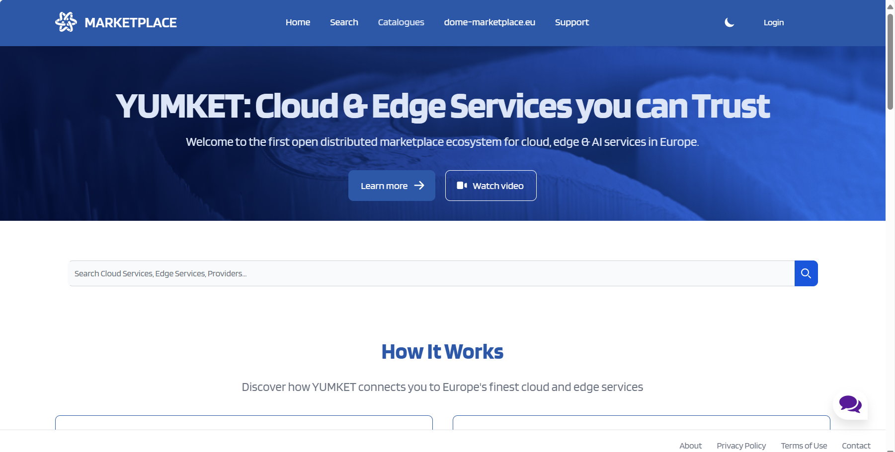

# Onboarding Guide for Cloud Service Providers (CSPs) in the DOME Marketplace

## 1. Introduction
### Purpose of the Guide
This guide is designed to facilitate the onboarding process for new Cloud Service Providers (CSPs) in the DOME Marketplace, ensuring a clear understanding of the necessary steps to complete registration and start publishing offers.

### Scope of the Marketplace
DOME Marketplace is a digital platform that enables CSPs to offer cloud and edge computing services to customers across Europe.

## 2. Prerequisites for Onboarding
### Eligibility Verification
Before beginning, ensure you meet the following criteria:
- Be a legally registered entity in an EU country.
- Have the capability to offer cloud or edge services.

## 3. Registration Process in the Marketplace
### Account Creation
#### Request for provisional account creation
To begin the process, visit the [DOME Marketplace website](https://dome-marketplace.org/). After navigating to the homepage, click on the "Contact Us" link.

**Enter your work email:** On the Contact Us page, input your work email address and submit. This is required to receive the verification code.

**Verification email:** Check your email for a confirmation message that includes a verification code.

**Complete the provisional CSP account creation:** With the verification code, return to the DOME Marketplace website to enter the code or use the link provided on the mail.

**Then you will be logged just press continue:**

### Filling Out Forms
#### Company information form
Fill in all required fields, making sure to use Latin characters.

## 4. Submission and Validation of Documentation
### Required Documents
You must submit the following documentation by emailing it to [onboarding@dome-marketplace.org](mailto:onboarding@dome-marketplace.org):
- **Certificate of Incorporation**: This document must display the complete name of the company, its date of incorporation, and the address of the registered office. It should not be older than three (3) months from the date the potential CSP is submitting its application to onboard.
- **VAT Certificate**: Issued by the competent authority in the country of registration. This certificate must also not be older than three (3) months from the date of application.
- **Power of Attorney**: A certified copy of the power of attorney or another document evidencing the source of the power of representation of the legal representative acting on behalf of the potential CSP.
- **Bank Account Certificate Form**: Completed and signed, in Latin characters.
- **Appointment of the Legal Entity Appointed Representative (LEAR) Form**: Completed and signed. You can find the form and more details here:
  [Download LEAR Form](https://dome-marketplace-prd.org/assets/documents/Legal-Entity-Appointed-Representative-Form-v-June-2024.pdf)
- **Declaration of Honor Form**: Completed and signed. Access the form via the following link:
  [Download Declaration of Honor Form](https://dome-marketplace-prd.org/assets/documents/DoH-for-company-v-June-2024.pdf)
- **Sworn Translations**: Any document not submitted in English or Spanish must include a sworn translation into English.
- **Marketplace Terms And Conditions for Cloud Service Providers**: It is essential to review and agree to the Terms and Conditions of the Marketplace, after the documentation submitted has been validated, you will be required to sign the Marketplace Terms And Conditions for Cloud Services Providers. Once you sign it and send it to onboarding@dome-marketplace.org the process of generating the verifiable credential will continue.
  [Marketplace Terms and Conditions](https://dome-marketplace-prd.org/assets/documents/Marketplace-Terms-And-Conditions-for-Cloud-Service-Providers-v-June-2024.pdf)

Additionally, Support documents that provide further clarification and guidance, you don't need to provide this documents:

- **Practical comments to Appointment Of Legal Entity Appointed Representative Form**: This document offers practical advice and detailed instructions on how to properly fill out the LEAR form.
  [Download Practical Comments on LEAR Form](https://dome-marketplace-prd.org/assets/documents/Practical-comments-to-APPOINTMENT-OF-LEGAL-ENTITY-APPOINTED-REPRESENTATIVE-FORM-v-June-2024.pdf)

If the CSP company has a Digital Certificate in the sense of the eIDAS Regulation, the document related to the power of attorney mentioned earlier is not needed.

### Documentation Review and Notification Process
After the required documentation has been submitted, the review process may take more than five business days. Then you will receive a notification about the status of their documentation:

- **Documentation Correct and Complete**: If all documents are in order and fully compliant, a notification confirming the correctness and completeness will be sent.

- **Error, Mistake, or Information Missing**: If there are any errors, mistakes, or missing information, you will be notified and given a fourteen (14) days term to complete or correct the documentation. Here's what happens next:
    - The new information will be reviewed once submitted.
    - If the corrections or additional documents are not provided in a satisfactory manner within the specified fourteen (14) days, then we will deem that you relinquish from your onboarding request.

It's crucial that all information provided during the application process is accurate and complete to prevent any delays or rejection during the review phase.

## 5. Signing the Marketplace Terms and Conditions
Before any offerings can be uploaded to the DOME Marketplace, it is mandatory for the CSP to sign the Marketplace Terms and Conditions. This contract solidifies your obligations and rights within the marketplace.

- **Contract Signing**:
    - After your documentation is verified and you are notified of approval, either your Legal Representative or the appointed LEAR must sign the Marketplace Terms and Conditions for Cloud Service Providers. This document outlines all legal requirements and operational standards expected of CSPs within the marketplace.

- **Submitting the Signed Contract**:
    - Once signed, the contract should be sent via email to [onboarding@dome-marketplace.org](mailto:onboarding@dome-marketplace.org). Only after this contract is received and processed by the DOME administrative team can the CSP begin to upload offerings to the marketplace.

## 6. Account Consolidation
Once all documentation is approved, your provisional account will be converted into an operational account.

## 6. Generation and Management of Verifiable Credentials
### For LEAR and CSP Operators
The Marketplace will generate verifiable credentials for you and your designated operators.
#### Registering on the DOME Digital Wallet
- **Access the Digital Wallet**:
    - For detailed instructions on how to register and set up your DOME Digital Wallet, please refer to the registration section in our comprehensive [Wallet Guide](https://github.com/DOME-Marketplace/wallet-guide/tree/initial-wallet-guide?tab=readme-ov-file#1-registering-on-the-dome-digital-wallet). This guide provides step-by-step instructions on creating your wallet account.

#### Receiving and Accepting the Credential Offer
- **Credential Offer**:
    - Within a few days after confirmation, you will receive an email with a credential offer. It is recommended to open this email on a different device from the one where the DOME Wallet is installed because you will need to scan the QR code with the wallet. Click on 'Start Credential Offer' in the email to proceed.
      
      

- **Information Screen**:
    - Upon opening the email, you will initially be presented with an informational screen containing detailed instructions on how to proceed. There will be a button labeled 'Get QR Code'. Pressing this button will display the QR code with the credential offer.

      

- **Scanning the QR Code**:
    - Once the QR code is displayed, use the QR scan function of your wallet to scan it. This is a critical step to ensure your digital credentials are linked correctly.
      
      
    - Look for the QR scan button in your wallet app to initiate the scanning process.
      
      

> **Note:** If you experience issues with the camera not activating or if the QR code is expired or already used, please consult the troubleshooting section of our [Wallet Guide](https://github.com/DOME-Marketplace/wallet-guide/tree/initial-wallet-guide?tab=readme-ov-file#5-troubleshooting-common-issues). For expired or used QR codes, email [domesupport@in2.es](mailto:domesupport@in2.es) to request a new QR code.

- **PIN Code Entry**:
    - After scanning the QR code, you will be prompted to enter a PIN code that you received by email. This PIN is crucial for verifying your identity and securing your credential.
      
      
      
      

#### Finalizing the Credential
- **Credential in Unsigned State**:
    - Once the PIN is entered, the credential will appear in your wallet in an 'unsigned' state, which means it is not yet validated or signed.
      
      

- **Manual Validation and Signing**:
    - The credential requires manual intervention for validation and signing. This process typically takes between 2-4 business days. You will be notified by email once your credential is signed and ready to be downloaded.
      
      

- **Downloading the Signed Credential**:
    - Go back to your wallet and click on the signature icon to download the signed credential. After this, the credential will no longer be in the 'unsigned' state.
      
      

- **Credential Ready for Use**:
    - You now have your LEAR Credential ready for use in the marketplace.
      
      

## 7. Additional LEAR Appointment
This section explains the process for issuing a LEAR credential to a new employee of a CSP that is already registered. This process ensures that newly authorized employees can act on behalf of the CSP.

### Credential Delegation Process
If you wish to change or appoint an additional LEAR, you must send a signed notification from the company’s legal representative to [onboarding@dome-marketplace.org](mailto:onboarding@dome-marketplace.org), and then submit a new LEAR appointment form and Declaration of Honor for the new LEAR.

## 8. How to Access the Portal Once You Have Your Credentials

This section will guide you through the steps to access the Dome Marketplace using the VC Login option, utilizing your LEAR credential.

### Step 1: Access DOME Marketplace

Visit the Dome Marketplace by clicking on the following link: [DOME Marketplace](https://dome-marketplace-prd.org).

### Step 2: Sign In

1. Click on the **Sign In** button on the marketplace homepage.

A QR code will be displayed on the screen. This QR code is unique to your login session and should be scanned using the DOME Wallet app.

> **Note**: Each QR code is unique and must be scanned during the current session to ensure security. Do not use QR codes from other sessions or sources.

### Step 3: Log into DOME Wallet

Navigate to the DOME Wallet website: [DOME Wallet](https://wallet.dome-marketplace-prd.org) and log into the wallet.

### Step 4: Scan QR Code

Go to the **Home** screen of your DOME Wallet and press the **Scan QR** button to scan the QR code displayed on the Dome Marketplace login page.

### Step 5: Complete Attestation Exchange

After scanning the QR code, your wallet and the marketplace's verifier initiate the Attestation Exchange process. You will be prompted in the wallet to select the credential you wish to present to access the portal. Confirm your selection to proceed.

Upon successful completion of the attestation, you will be redirected and logged into the marketplace. This marks the completion of the secure login process using your VC.

You are now logged into the Dome Marketplace.

## 9. Publishing Offers in the Marketplace

### Offer Descriptions
All offers must meet the minimum criteria set by the Marketplace, when describing your offers, make sure to include all necessary technical and compliance details, for more detailed information about the criteria, please consult the following document on Description of Offerings section:
[Criteria Document](https://dome-marketplace-prd.org/assets/documents/DOME-Marketplace-Procedures-v-june-2024.pdf)

## 10. Complaint Resolution and Intellectual Property Rights Infringement Management
### Complaint Submission Process
If you have any complaints, send them to [legal.helpdesk@dome-marketplace.org](mailto:legal.helpdesk@dome-marketplace.org) with all relevant details.

## 11. Contact and Support
For further help, contact our technical support at [support@dome-marketplace.org](mailto:support@dome-marketplace.org).
